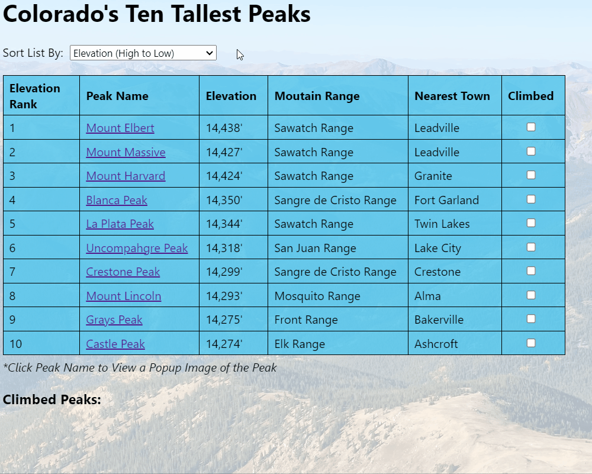
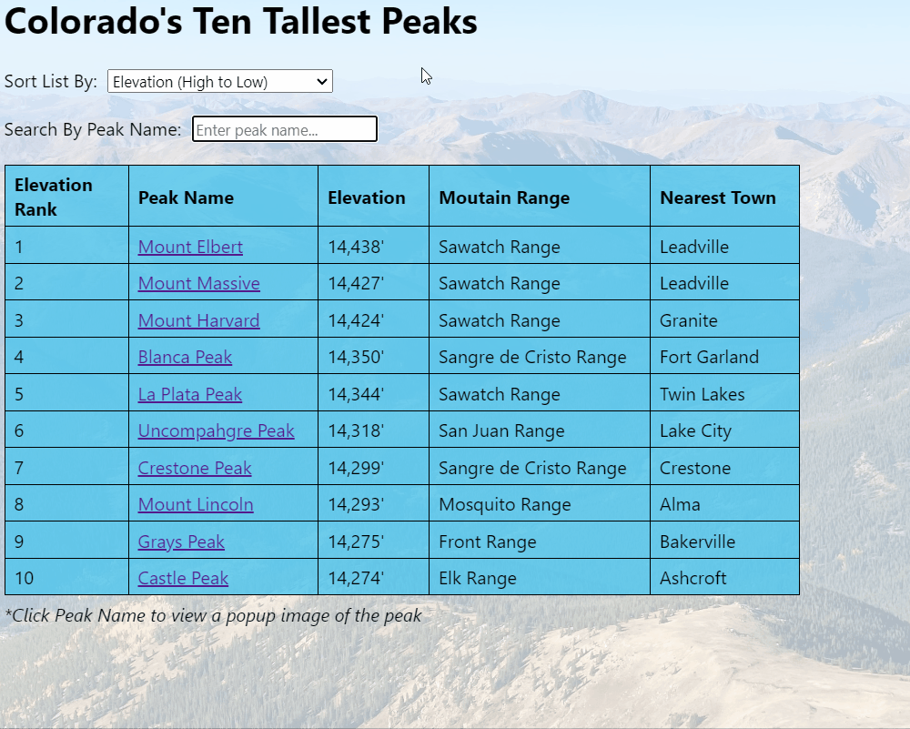
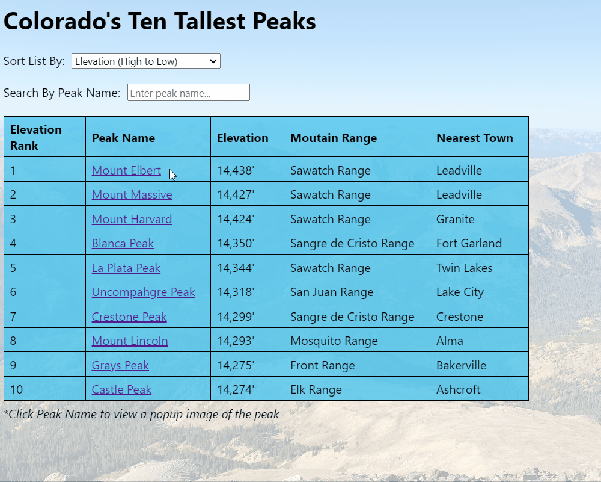

# Colorado's Ten Tallest Peaks

Colorado's Ten Tallest Peaks is a web application that displays information about Colorado's tallest peaks. It has the following interactive features: 

- Users can sort the table according to the peaks' elevation (ascending or descending), name, mountain range, and nearest town. 
- Users can search by peak name by entering text into the search bar, which will filter the table to display any peaks that include the search text. The search feature is case insensitive, so entering "peak" will display all peaks with "Peak" in their name.
- Users can see a popup image of each peak by clicking on the name of the peak. Only one popup image will display at a time, so clicking on a second link will close the fist popup image and open the second one. 

## Examples of the application's features

**Sorting the table according to differnt sort options:**

<br> 

**Searching the table by peak name:**

<br>  

**Clicking on a peak name to see a popup image of the peak:**



## Data Source

The application fetches data from its db.json file. With `json-server` installed globally, users can run the following command to run the server: 

```console
$ json-server --watch db.json
```

The application will then make a GET request to `http://localhost:3000/colorado14ers` to fetch data from the db.json file each time the page refreshes. 

## Credits

The background image of the index.html file was taken by the application's author. The image URLs of each peak in the db.json file are from each peak's Wikipedia page.   

Here are photo credits for image URLs in the db.json file:<br>  
- Blanca Peak: <a href="https://commons.wikimedia.org/wiki/File:Mount_Massive.jpg">Rick Kimpel, Jr.</a>, Public domain, via Wikimedia Commons
- Castle Peak: <a href="https://commons.wikimedia.org/wiki/File:Castle_Peak_CO_Full.JPG">Dbunde</a>, Public domain, via Wikimedia Commons
- Crestone Peak: <a href="https://commons.wikimedia.org/wiki/File:Crestone_peak_2.jpg">Adam Ginsburg</a>, <a href="https://creativecommons.org/licenses/by-sa/2.5">CC BY-SA 2.5</a>, via Wikimedia Commons
- Grays Peak: <a href="https://commons.wikimedia.org/wiki/File:Grays_and_Torreys_Peaks_2006-08-06.jpg">Daidipya</a>, <a href="https://creativecommons.org/licenses/by/2.0">CC BY 2.0</a>, via Wikimedia Commons
- La Plata Peak: <a href="https://commons.wikimedia.org/wiki/File:2007-06-24-plata-eve-close2.jpg">Robertbody at English Wikipedia</a>, <a href="https://creativecommons.org/licenses/by/3.0">CC BY 3.0</a>, via Wikimedia Commons
- Mount Elbert: <a href="https://commons.wikimedia.org/wiki/File:Mt._Elbert.jpg">Hogs555</a>, <a href="https://creativecommons.org/licenses/by-sa/4.0">CC BY-SA 4.0</a>, via Wikimedia Commons
- Mount Harvard: <a href="https://commons.wikimedia.org/wiki/File:Mount_Harvard_(Colorado)_-_2006-07-16.jpg">jokermanj</a>, <a href="https://creativecommons.org/licenses/by/2.0">CC BY 2.0</a>, via Wikimedia Commons
- Mount Lincoln: <a href="https://commons.wikimedia.org/wiki/File:Mount_Lincoln_Colorado_July_2016.jpg">Thomson200</a>, CC0, via Wikimedia Commons
- Mount Massive: <a href="https://commons.wikimedia.org/wiki/File:Mount_Massive.jpg">Rick Kimpel, Jr.</a>, Public domain, via Wikimedia Commons
- Uncompahgre Peak: <a href="https://commons.wikimedia.org/wiki/File:Uncompahgre_peak.jpg">Gregstoner88 at the English Wikipedia</a>, <a href="http://creativecommons.org/licenses/by-sa/3.0/">CC BY-SA 3.0</a>, via Wikimedia Commons

The following MDN Web Documents were also referenced in the making of this application: 

- <a href="https://developer.mozilla.org/en-US/docs/Web/API/Element/classList">MDN Web Docs: Element: classList property</a>
- <a href="https://developer.mozilla.org/en-US/docs/Web/API/EventTarget/addEventListener">MDN Web Docs: EventTarget: addEventListener() method</a>
- <a href="https://developer.mozilla.org/en-US/docs/Web/API/fetch">MDN Web Docs: fetch() global function</a>
- <a href="https://developer.mozilla.org/en-US/docs/Web/JavaScript/Reference/Global_Objects/parseInt">MDN Web Docs: parseInt()</a>
- <a href="https://developer.mozilla.org/en-US/docs/Web/JavaScript/Reference/Global_Objects/Promise/then">MDN Web Docs: Promise.prototype.then()</a>
- <a href="https://developer.mozilla.org/en-US/docs/Web/API/Response/json">MDN Web Docs: Response: json() method</a>
- <a href="https://developer.mozilla.org/en-US/docs/Web/JavaScript/Reference/Global_Objects/String/trim">MDN Web Docs: String.prototype.trim()</a>
- <a href="https://developer.mozilla.org/en-US/docs/Web/HTML/Element/a">MDN Web Docs: The Anchor element</a>
