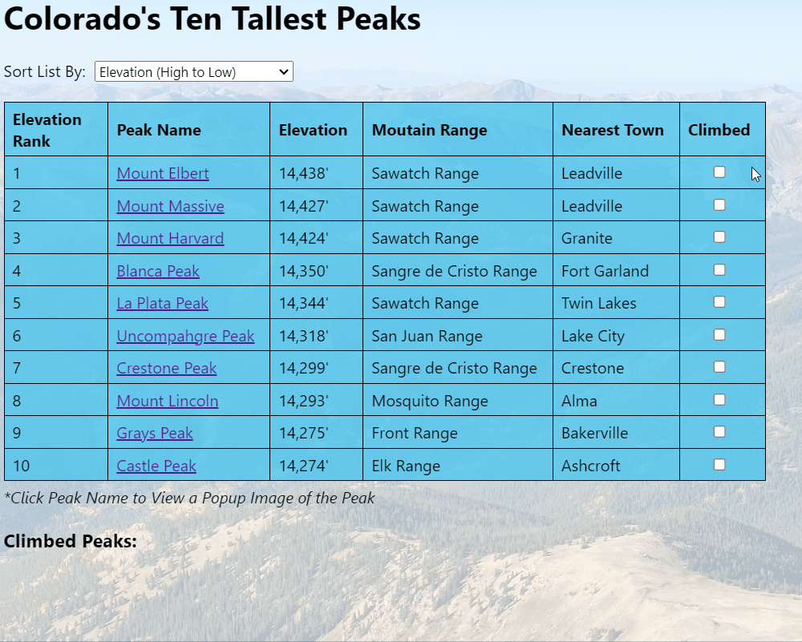

# Colorado's Ten Tallest Peaks

Colorado's Ten Tallest Peaks is a web application that displays information about Colorado's tallest peaks. It has the following interactive features: 

- Users can sort the information table according to the peaks' elevation (ascending or descending), name, mountain range, and nearest town. 
- Users can select a checkbox next to each peak to indicate that they have climbed the peak, which will add the peak's name to a list of "Climbed Peaks" at the bottom of the page. 
- Users can see a popup image of each peak (which were selected from each peak's Wikipedia page) by clicking on the name of the peak.

## Examples of the application's features

**Sorting the table according to differnt sort options:**

<br> 

**Selecting a checkbox to add the corresponding peak to the Climbed Peaks list:**

<br>  

**Clicking on a peak name to see a popup image of the peak:**


## Data Source

The application fetches data from its db.json file. With `json-server` installed globally, users can run the following command to run the pseudoserver: 

```console
$ json-server --watch db.json
```

The application will then make a GET request to `http://localhost:3000/colorado14ers` to fetch data from the db.json file each time the page refreshes. 

## Credits

The background image of index.html was taken by the author of the application. The image URLs of each peak in the db.json file are from each peak's Wikipedia page.   

Photo credits for image URLs in the db.json file:<br>  
- Blanca Peak: <a href="https://commons.wikimedia.org/wiki/File:Mount_Massive.jpg">Rick Kimpel, Jr.</a>, Public domain, via Wikimedia Commons
- Castle Peak: <a href="https://commons.wikimedia.org/wiki/File:Castle_Peak_CO_Full.JPG">Dbunde</a>, Public domain, via Wikimedia Commons
- Crestone Peak: <a href="https://commons.wikimedia.org/wiki/File:Crestone_peak_2.jpg">Adam Ginsburg</a>, <a href="https://creativecommons.org/licenses/by-sa/2.5">CC BY-SA 2.5</a>, via Wikimedia Commons
- Grays Peak: <a href="https://commons.wikimedia.org/wiki/File:Grays_and_Torreys_Peaks_2006-08-06.jpg">Daidipya</a>, <a href="https://creativecommons.org/licenses/by/2.0">CC BY 2.0</a>, via Wikimedia Commons
- La Plata Peak: <a href="https://commons.wikimedia.org/wiki/File:2007-06-24-plata-eve-close2.jpg">Robertbody at English Wikipedia</a>, <a href="https://creativecommons.org/licenses/by/3.0">CC BY 3.0</a>, via Wikimedia Commons
- Mount Elbert: <a href="https://commons.wikimedia.org/wiki/File:Mt._Elbert.jpg">Hogs555</a>, <a href="https://creativecommons.org/licenses/by-sa/4.0">CC BY-SA 4.0</a>, via Wikimedia Commons
- Mount Harvard: <a href="https://commons.wikimedia.org/wiki/File:Mount_Harvard_(Colorado)_-_2006-07-16.jpg">jokermanj</a>, <a href="https://creativecommons.org/licenses/by/2.0">CC BY 2.0</a>, via Wikimedia Commons
- Mount Lincoln: <a href="https://commons.wikimedia.org/wiki/File:Mount_Lincoln_Colorado_July_2016.jpg">Thomson200</a>, CC0, via Wikimedia Commons
- Mount Massive: <a href="https://commons.wikimedia.org/wiki/File:Mount_Massive.jpg">Rick Kimpel, Jr.</a>, Public domain, via Wikimedia Commons
- Uncompahgre Peak: <a href="https://commons.wikimedia.org/wiki/File:Uncompahgre_peak.jpg">Gregstoner88 at the English Wikipedia</a>, <a href="http://creativecommons.org/licenses/by-sa/3.0/">CC BY-SA 3.0</a>, via Wikimedia Commons


