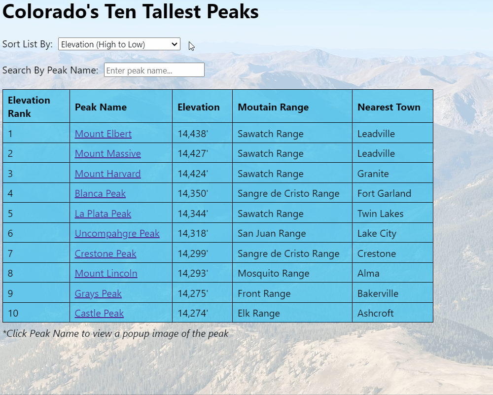

# Phase 1 Project - Colorado's Ten Tallest Peaks

Colorado's Ten Tallest Peaks is a web application that displays information about Colorado's tallest peaks. It has the following interactive features: 

- Users can sort the information table according to the peaks' elevation (ascending or descending), name, mountain range, and nearest town. 
- Users can select a checkbox next to each peak to indicate that they have climbed the peak, which will add the peak's name to a list of "Climbed Peaks" at the bottom of the page. 
- Users can see a popup image of each peak (which were selected from each peak's Wikipedia page) by clicking on the name of the peak.

## Examples of the application's features

Here are examples of the application's features: 

Sorting the table according to differnt sort options



Selecting a checkbox to add the corresponding peak to the Climbed Peaks list


Clicking on a peak name to see a popup image of the peak


## Data Source

The application fetches data from its db.json file. With `json-server` installed globally, users can run the following command to run the pseudoserver: 

```console
$ json-server --watch db.json
```

The application will then make a GET request to `http://localhost:3000/colorado14ers` to fetch data from the db.json file each time the page refreshes. 

## Credits

The image URLs of each peak in the db.json file are from each peak's Wikipedia page. The background image of index.html was taken by the author of the application.  

